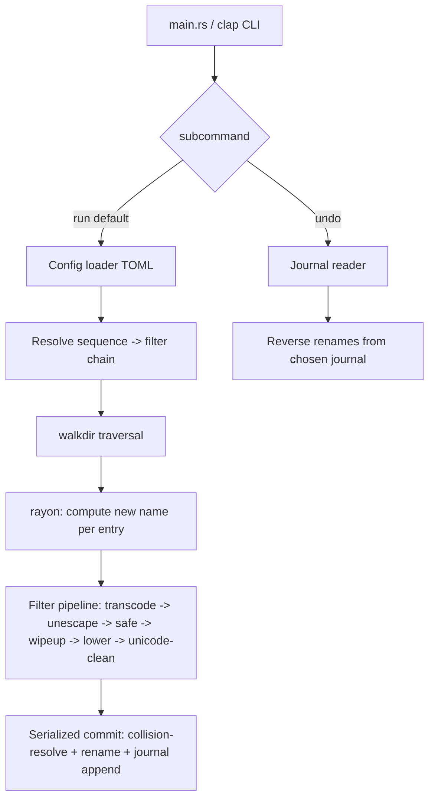

# rehab — Implementation Plan

A modern reimagining of `detox`: rename files/directories to replace problematic
characters, built on the existing Rust scaffold. Not bound to detox's flag names
or `.detoxrc` syntax; detox is a feature reference only.

## Requirements (decisions)

- Modern reimagining; detox is a feature reference, not a flag-for-flag spec.
- Full filter set: `safe`, `wipeup`, `lower`, `unicode-clean`, ISO-8859-1/CP-1252 → UTF-8 transcoding, `cgi-unescape`.
- Pragmatic use of established crates.
- TOML config with named sequences (ordered filter chains), a configurable default, and `--sequence` to select one.
- Auto-detect non-UTF-8 filenames and transcode by default.
- Improvements: numeric-suffix collision handling (with flag), undo/journal + `undo` subcommand, parallelism.
- Per-run timestamped JSONL journal in a state dir; `undo` reverts the most recent or a specified run; synchronized append writer.
- rayon thread pool with a serialized final rename/collision step for deterministic, race-free suffixing; `--jobs/-j` flag, default = available parallelism.
- Scope limited to file/dir renaming — no inline mode, no `--special`.

## Background

- Existing scaffold: `src/main.rs` has a hand-rolled arg parser, `greeting`/`run`
  functions, inline unit tests; `tests/cli.rs` runs the built binary via
  `CARGO_BIN_EXE_rehab`. Zero dependencies, edition 2024, toolchain updated to 1.98.1.
- The scaffold will be replaced by a real module structure, but the testing
  patterns (inline unit tests + `tests/cli.rs` integration harness via
  `CARGO_BIN_EXE_rehab`) are preserved and extended.
- Crate choices (major versions; exact patch resolved at build):
  `clap` v4 (derive, subcommands), `walkdir` v2, `rayon` v1,
  `encoding_rs` v0.8 + `chardetng` for detection, `serde` v1 + `toml` v0.8,
  `serde_json` v1 for journal, `dirs` for platform state/config paths, and
  `assert_cmd` + `tempfile` (dev-deps) for CLI/filesystem tests.

## Architecture

Module layout:

- `src/main.rs` — thin entry; parse CLI, dispatch, set exit code.
- `src/cli.rs` — clap definitions (`run` default + `undo` subcommand; flags:
  `--dry-run/-n`, `--recursive/-r`, `--verbose/-v`, `--sequence/-s`,
  `--jobs/-j`, `--on-collision`, `--config/-f`, `--list-sequences/-L`).
- `src/filters/` — one module per filter, each implementing a common `Filter`
  trait (`fn apply(&self, name: &str) -> String`), plus transcode logic on raw bytes.
- `src/sequence.rs` — a `Sequence` = ordered `Vec<Box<dyn Filter>>`; built-ins + config resolution.
- `src/config.rs` — serde/TOML model, default config, discovery.
- `src/walk.rs` — traversal (recursion, hidden-file skipping, ignore list).
- `src/rename.rs` — collision resolution + serialized commit step.
- `src/journal.rs` — JSONL record type, synchronized writer, reader, undo logic.

## Task Breakdown

Follow TDD and incremental integration — each task produces a working, demoable
increment with no orphaned code. Tasks build on each other and end with wiring.

### Task 1: Restructure scaffold + `Filter` trait and `safe` filter
Replace greeting logic with a `Filter` trait; implement `safe` (replace spaces
and shell-problematic chars — `(){}[]&;|<>*?!'"$` etc. — with a configurable
separator, default `_`). Keep `main.rs` minimal, wiring a hardcoded `safe`-only
pipeline that reads names from args and prints cleaned output (no renaming yet).
- Tests: unit tests per character class in `src/filters/safe.rs`; update
  `tests/cli.rs` so `rehab <name>` prints the cleaned name.
- Demo: `rehab "my file (1).txt"` prints `my_file_1_.txt`.

### Task 2: clap CLI with `run` subcommand and core flags
Introduce `clap` v4 derive. Define default `run` behavior and flags
`--dry-run/-n`, `--recursive/-r`, `--verbose/-v`, `--jobs/-j` (parsed, not all
wired yet), and positional paths. Replace hand-rolled parsing.
- Tests: `tests/cli.rs` for `--help` (usage + each flag), unknown-flag error
  exit code, flag parsing via a debug path.
- Demo: `rehab --help` shows modern usage; `rehab -n "a b.txt"` prints cleaned name.

### Task 3: Single-file rename with dry-run and verbose
Add `src/rename.rs`: compute cleaned basename via the pipeline and rename on
disk; `--dry-run` prints the planned change without touching the FS; `--verbose`
reports each rename.
- Tests: integration via `tempfile` + `assert_cmd` — create a bad-named file,
  run `rehab`, assert renamed; assert dry-run leaves it unchanged but prints plan.
- Demo: `rehab "bad name.txt"` → `bad_name.txt`; `rehab -n` shows the plan only.

### Task 4: Collision handling with numeric suffixes
Add `--on-collision` (`suffix` default, `skip`, `overwrite`). On `suffix`,
append `-1`, `-2`, … before the extension until free.
- Tests: two names colliding produce `name.txt` and `name-1.txt`; `skip` leaves
  the second unchanged; verify extension-aware suffix placement.
- Demo: `a b.txt` and `a  b.txt` → `a_b.txt` and `a_b-1.txt`.

### Task 5: Recursive traversal
Add `src/walk.rs` using `walkdir`, gated by `--recursive`; skip hidden entries
(leading `.`) unless explicitly passed; rename depth-first (children before
parents) so directory renames don't invalidate child paths.
- Tests: nested temp tree with bad names at multiple depths; assert all renamed
  and hidden dirs skipped; non-recursive mode only touches top-level args.
- Demo: `rehab -r ./messy_dir` cleans the whole tree.

### Task 6: Remaining filters — wipeup, lower, unicode-clean, cgi-unescape
Implement each as a `Filter`: `wipeup` (collapse repeated separators, trim
leading/trailing separators/dots), `lower` (lowercase), `unicode-clean` (strip
Unicode control/format chars), `cgi-unescape` (decode `%XX`).
- Tests: unit tests per filter covering representative inputs/edge cases
  (empty-result guard, multibyte safety).
- Demo: cleaning `%20My--File__.TXT` through the chain.

### Task 7: Sequences + built-in defaults
Add `src/sequence.rs`: a `Sequence` is an ordered filter list; ship built-ins
(`safe`, `safe-lower`, `iso8859_1`, `utf8`) with default = safe + wipeup +
unicode-clean. Wire `--sequence/-s` and `--list-sequences/-L`.
- Tests: resolving each built-in yields expected filter order; `-L` lists names;
  `-Lv` shows filters per sequence; unknown sequence errors.
- Demo: `rehab -L` lists sequences; `rehab -s safe-lower file` lowercases.

### Task 8: TOML config with named sequences
Add `src/config.rs` (serde + toml): parse `[sequences.<name>]` (filter list +
options like separator/collision) and a `default` key; discovery order
`--config/-f` > `~/.config/rehab/config.toml` > built-ins; config sequences
merge over/extend built-ins.
- Tests: load a temp config with custom sequence + default; assert it overrides
  built-ins; malformed config errors clearly; `-f` bypasses user config.
- Demo: a config file adds a `myseq` sequence usable via `-s myseq`.

### Task 9: Auto-detect + transcode non-UTF-8 filenames by default
Add byte-level transcoding using `chardetng` for detection and `encoding_rs` to
convert detected ISO-8859-1/CP-1252 (etc.) filename bytes to UTF-8 before text
filters run; operate on `OsStr`/bytes to handle non-UTF-8 names safely.
- Tests: filenames with non-UTF-8/Latin-1 bytes in a temp dir; assert
  transcoded to correct UTF-8 then cleaned; already-UTF-8 names untouched.
- Demo: a CP-1252-named file becomes a proper UTF-8, cleaned name.

### Task 10: Parallel processing with deterministic commit
Introduce `rayon`: compute planned new names in parallel across traversal
entries, then perform collision-resolution + rename in a single serialized pass
ordered deterministically (e.g., by original path) so suffix numbering is
race-free. Wire `--jobs/-j` (default = available parallelism).
- Tests: large temp tree produces identical results across repeated runs and
  across `-j 1` vs `-j 8` (determinism); correctness matches sequential baseline.
- Demo: `rehab -r -j 8 big_tree` cleans a large tree with stable output.

### Task 11: Per-run journal (JSONL) with synchronized writer
Add `src/journal.rs`: each `run` writes a timestamped journal
(`~/.local/state/rehab/journal-<ts>.jsonl` via `dirs`), one JSON record per
rename `{from, to, ts}`, appended through a synchronized writer safe under
rayon. Skip journaling on `--dry-run`.
- Tests: after a run, assert the journal exists and has one record per rename
  with correct paths; concurrent writes under parallelism all captured.
- Demo: after `rehab -r dir`, the newest journal lists every rename.

### Task 12: `undo` subcommand
Add `rehab undo` that reads the most recent journal (or `--journal <path>`),
reverses renames in inverse order, and handles missing/occupied targets
gracefully (report and continue). Supports `--dry-run` and `--verbose`.
- Tests: run → undo restores original names; `undo` on a specified older
  journal; conflict path reported without aborting the whole undo.
- Demo: `rehab -r dir` then `rehab undo` returns the tree to original names.

### Task 13: Documentation and Makefile check
Update `README.md` with usage, sequences, config format, and undo. Confirm
`make all` (fmt-check, clippy `-D warnings`, build, test) passes for the full
suite and that `cargo run` and the built binary behave as documented.
- Tests: whole suite green under `make all`; add missing edge-case tests
  surfaced during integration.
- Demo: `make all` passes end-to-end; README examples work.

## Notes for parallel implementation

Suggested dependency ordering for parallel agents (later tasks depend on earlier):

- Tasks 1, 6 (filters) are largely independent once the `Filter` trait from
  Task 1 exists — Task 6 filters can be built in parallel after Task 1 lands.
- Task 2 (CLI) is a prerequisite for Tasks 3, 5, 7, 10, 12 (flag wiring).
- Task 3 (rename) precedes Tasks 4, 5, 10, 11.
- Task 7 (sequences) precedes Task 8 (config) and depends on Tasks 1 + 6.
- Task 11 (journal) precedes Task 12 (undo) and interacts with Task 10 (must be
  thread-safe under rayon).
- Task 13 is last (integration + docs).

Preserve the existing test harness style: inline `#[cfg(test)]` unit tests per
module + `tests/cli.rs` integration tests via `CARGO_BIN_EXE_rehab`, plus
`tempfile`/`assert_cmd` for filesystem/CLI behavior. Run `make all` before
considering any task complete.
